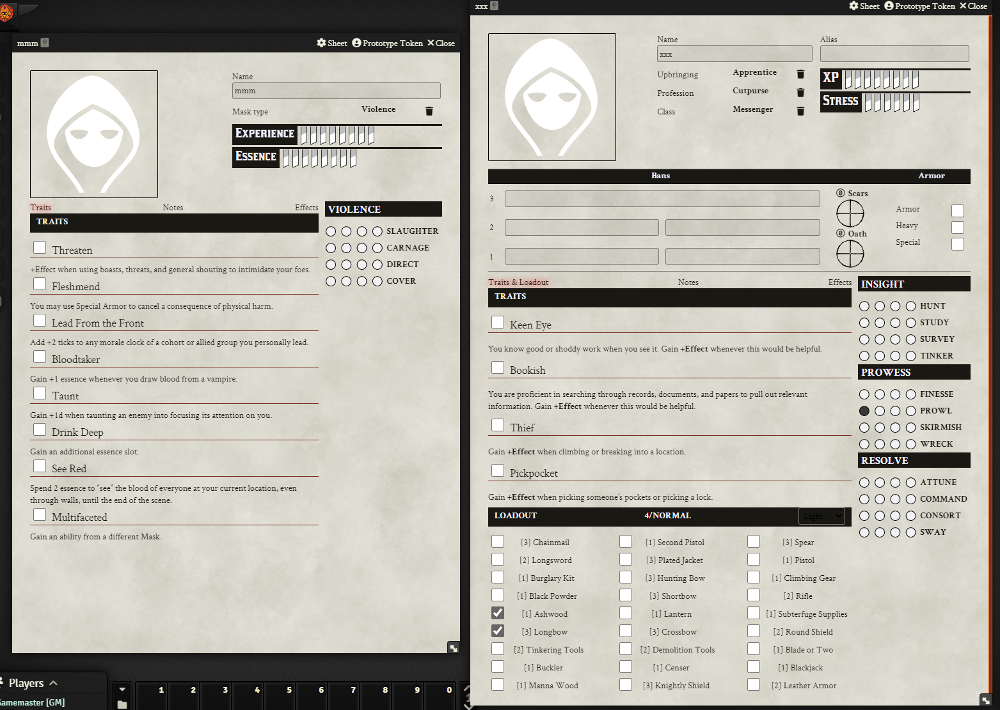

# This is a WIP for a Brinkwood games system for Foundry VTT

## v0.5 - first "public" release

This a barebones implementation of Brinkwood its still heavily based on megastrukturs Blades in The Dark and has *waaay* too much leftover/unused logic.
Be warned, this is not stable and is susceptible to massive overhauls, I will try to implement all changes in a non-game-breaking manner but YOU HAVE BEEN WARNED.

### So, what works?
The basics: working sheets for characters and masks. With rollable actions and resistance rolls, all of the upbringings, professions, and mask types should have correct traits/special abilities selectable on the list. Character sheets have additionally a selectable list of all basic items with a proper load calculation.

#### Screenshots

### What doesn't?
Bonus action scores at character creation and Blood Alchemy types - and everything else ;)

### What's next?
- The biggest annoyance right now are the bonus action scores from the professions/classes - this is a small thing but a nice QOL addition.
- Downtime rolls available from character sheets.
- Rebellion record sheet.
- Two-point mask abilities: Drink Deep and Multifaceted (along with crossmask ability selection).
- Better popups.
- Fay dossier sheet.
- Overhauling sheet design.
- Custom clock on sheets.
- ???

## How to get in touch?
Make an issue or contact me on the official Brinkwood or Foundry (in forged-in-the-dark) discord (quad#8681).

# Credits

This is based on megastruktur's Blades in the Dark system, that you can find [here](https://github.com/megastruktur/foundryvtt-blades-in-the-dark)

This is not an official Brinkwood system and is *not* accociated with Far Horizons Co-op or any of the authors (but I hope someday it will!) 
